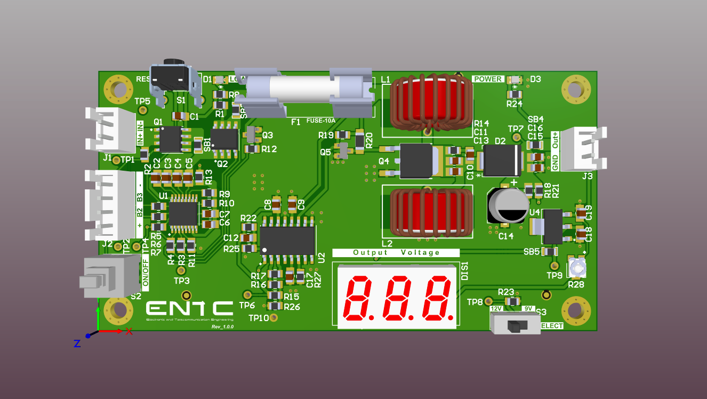
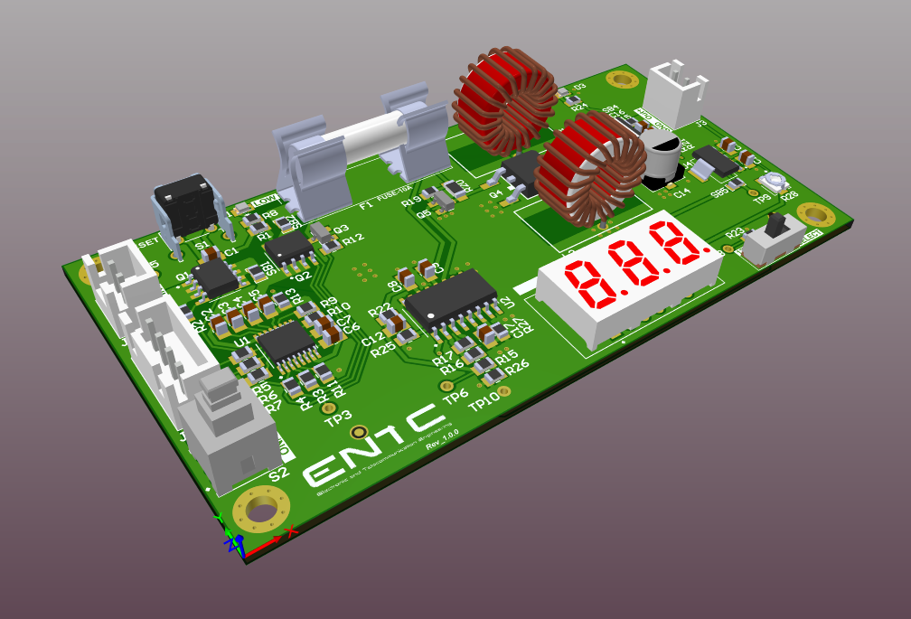
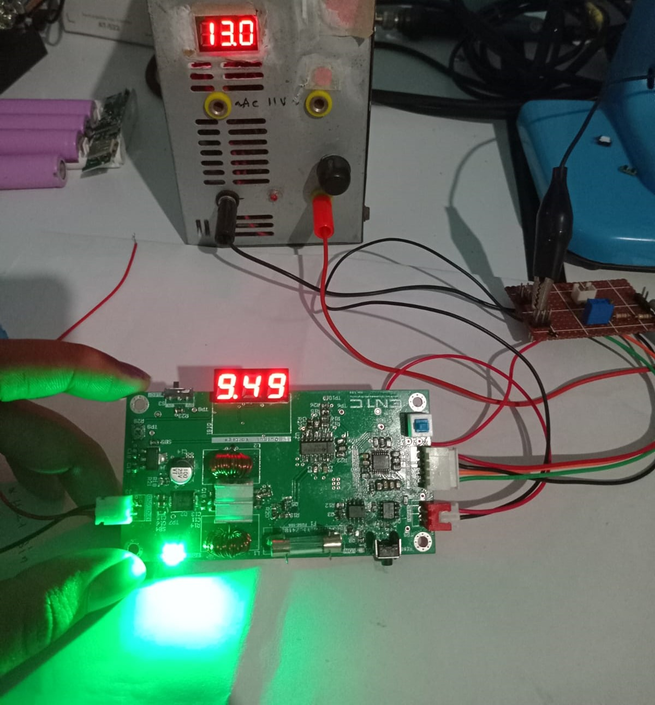

# DC-DC Buck-Boost Converter

## Overview
This project involves the design and implementation of a DC-DC buck-boost converter powered by a **3 x 3.7V series lithium-ion/polymer battery pack**. The converter operates within an input voltage range of **8V to 13V** and provides a **selectable output voltage of 9V or 12V** with a maximum output current of **2A**.

## Features
- **Selectable Output Voltage**: 9V or 12V
- **Maximum Output Current**: 2A
- **Undervoltage Protection**: Automatically disconnects input when any battery cell drops below **2.7V** to prevent over-discharge
- **High-Efficiency Switching**: Controlled by a **TL494 PWM controller**
- **Switching Frequency**: **250 kHz**, optimized for inductor size reduction
- **MOSFET Driver**: Dedicated low-side, high-frequency driver for efficient power switching
- **Toroidal Inductors**: Used to prevent core saturation and improve performance
- **Real-time Monitoring**: Integrated **3-digit 7-segment display** for output voltage visualization
- **Custom PCB Design**: Designed using **Altium Designer** and fabricated by **JLCPCB**

## Schematic and PCB Design
The entire circuit, including power regulation, control logic, and display integration, was designed using **Altium Designer**. The PCB was fabricated as a **2-layer board** to optimize layout and cost while maintaining efficiency and performance.

## System Protection
To ensure battery longevity and system reliability, the following protection mechanisms were implemented:
- **Undervoltage Protection**: Monitors each cell voltage and disconnects input if any cell drops below 2.7V.

### PCB Images
#### Top View

#### Perspective View

#### Assembled PCB

